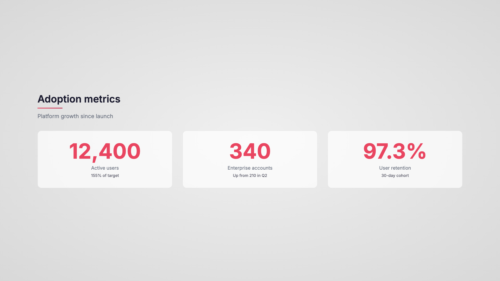
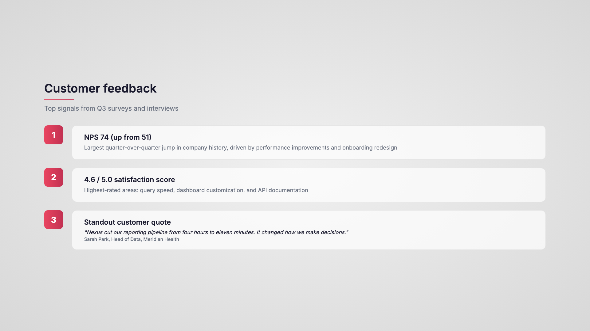
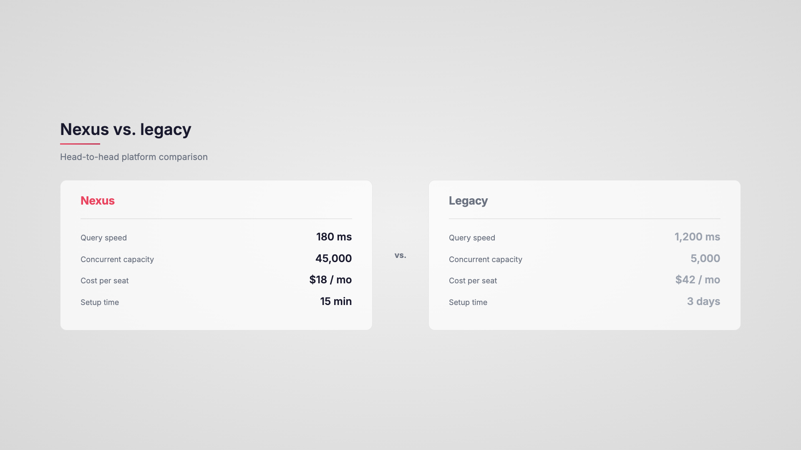

# Render-em

Turn text into animated presentations and video clips -- right from your terminal.

Render-em is a [Claude Code](https://docs.anthropic.com/en/docs/claude-code) plugin with two modes:

- **Render-em Slides** -- Text to animated HTML slide decks with optional PPTX export
- **Render-em Motion** -- Text to animated video clips (ProRes/MP4) for NLE compositing

One brand. Two output modes. Three words to explain it: "Render them out."

### Example output (Slides)

Generated from a [44-line product launch review](slides/examples/demo-content.txt):

| | |
|---|---|
|  |  |
|  |  |
|  |  |


---

## Installation

### As a plugin (recommended)

```bash
git clone https://github.com/MarkSloane/render-em.git
claude --plugin-dir path/to/render-em
```

### Manual install

Copy the skills into your personal skills folder:

```bash
cp -r slides ~/.claude/skills/render-em-slides
cp -r motion ~/.claude/skills/render-em-motion
```

### Dependencies

**Slides -- Native PPTX** (editable text and shapes):

```bash
pip3 install python-pptx lxml
```

**Slides -- Screenshot PPTX** (pixel-perfect images):

```bash
pip3 install playwright python-pptx
python3 -m playwright install chromium
```

**Motion -- Video capture:**

```bash
npm install puppeteer
brew install ffmpeg
```

---

## Usage

### Slides

```bash
claude "/render-em-slides path/to/content.txt"
```

What happens:
1. Content analysis -- plans 4-8 slides, choosing the best visual archetype for each
2. Slide plan review -- approve or adjust before generation
3. HTML generation -- standalone animated HTML files with CSS motion graphics
4. Player assembly -- lightweight browser-based presentation player
5. PPTX export -- native (editable) or screenshot (pixel-perfect)

Navigate with arrow keys, spacebar to advance, F for fullscreen.

### Motion

```bash
claude "/render-em-motion path/to/content.txt"
```

What happens:
1. Content analysis -- plans animation clips with archetypes and durations
2. Clip plan review -- approve or adjust before generation
3. HTML generation -- self-contained 4K animation files with CSS keyframes
4. Video capture -- frame-by-frame capture via Puppeteer, encoded to ProRes 4444

Output: individual `.mov` clips ready for DaVinci Resolve, Premiere, or Final Cut.

---

## Brand Theming

Both skills share a theme system at `~/.render-em/themes/`. On first run, you'll be offered four setup options:

1. **Share a PDF brand guide** -- auto-extracts colors, fonts, and style
2. **Share a .pptx template** -- pulls colors and fonts from PowerPoint theme XML
3. **Provide hex codes** -- just a primary and accent color
4. **Use clean defaults** -- start immediately

### Theme JSON format

```json
{
  "font": "Inter",
  "font_weights": "300;400;500;600;700",
  "font_import": "https://fonts.googleapis.com/css2?family=Inter:wght@300;400;500;600;700&display=swap",
  "primary_color": "#1a1a2e",
  "accent_color": "#e94560",
  "accent_gradient": "linear-gradient(90deg, #e94560, #c23152)",
  "secondary_text": "#6b7280",
  "background": "radial-gradient(ellipse at center, #f0f0f0 0%, #d8d8d8 100%)"
}
```

---

## Slide Archetypes

| Archetype | When to use |
|---|---|
| **Title Card** | Opening slide, section breaks |
| **Stat Cards** | Multiple metrics (2-4 cards) |
| **Stat Reveal** | Single hero KPI |
| **Bar Comparison** | Comparing values |
| **Side-by-Side** | Before/after, us vs. them |
| **Numbered List** | Priorities, steps |
| **Icon Cards** | Features, capabilities |
| **Stacked Layers** | Components of a whole |

## Motion Archetypes

| Archetype | Duration | When to use |
|---|---|---|
| **Title Card** | 5.5-6s | Video openers, section breaks |
| **Question Bumper** | 5.5-6s | Numbered segment intros |
| **Stat Reveal** | 5.5-6s | Single hero metric |
| **Bar Comparison** | 7-8s | Side-by-side value comparison |
| **Stacked Layers** | 7-8s | Layered components |
| **Stat Cards** | 7-8s | Multiple metrics |
| **Puzzle Grid** | 8-9s | Fragmented vs. complete data |
| **Branching Workflow** | 8-9s | Multi-step vs. unified approach |
| **Side-by-Side** | 8-9s | Two-column comparison |

---

## Native PPTX Toolkit

The `RenderEmNative` class generates editable PowerPoint files with real text, shapes, and entrance animations.

### Quick start

```python
import sys, os
sys.path.insert(0, os.path.expanduser("~/.claude/skills/render-em-slides/scripts"))
from native_pptx import RenderEmNative

sf = RenderEmNative()
slide = sf.add_slide()

sf.add_textbox(slide, Inches(1), Inches(1), Inches(6), Inches(1),
               "Hello, Render-em", font_size=Pt(36), bold=True)

sf.add_gradient_line(slide, Inches(1), Inches(2.2), Inches(3))

card = sf.add_card(slide, Inches(1), Inches(3), Inches(5), Inches(2.5))
sf.add_bullet_list(slide, Inches(1.3), Inches(3.3), Inches(4.4), Inches(2),
                   ["First point", "Second point", "Third point"])

sf.add_fade_stagger(slide, [card], start_delay=100, gap=60)
sf.save("output.pptx")
```

### Design rules

- **Shadows**: Only on cards/boxes. Apple-style, ~90% transparency. Never on lines, bars, badges, or text.
- **Animations**: Snappy -- 125ms duration, 50-75ms stagger gaps.
- **Gradients**: Always horizontal (left-to-right) on lines and bars.
- **Layout**: Widescreen 16:9 (13.333 x 7.5 inches), 1-inch margins.
- **Text**: Sentence case by default.

---

## Capture Pipeline (Motion)

The capture script converts HTML/CSS animations into ProRes 4444 video at 4K:

```
HTML/CSS animation → Puppeteer (frame-by-frame at 29.97fps) → FFmpeg → ProRes 4444 (.mov)
```

| Setting | Value |
|---|---|
| Resolution | 3840 x 2160 (4K UHD) |
| Frame rate | 29.97 fps |
| Codec | ProRes 4444 |
| Pixel format | 10-bit with alpha |

---

## Project Structure

```
render-em/
  .claude-plugin/
    plugin.json               # Plugin manifest
  slides/
    SKILL.md                  # Slide generation skill
    scripts/
      native_pptx.py          # Editable PPTX toolkit
      html_to_pptx.py         # Screenshot PPTX exporter
    examples/
      demo-content.txt        # Sample input
  motion/
    SKILL.md                  # Video animation skill
    scripts/
      capture.js              # Puppeteer + FFmpeg capture pipeline
      package.json
  docs/
    screenshots/              # Slide screenshots for reference
```

---

## License

MIT -- see [LICENSE](LICENSE).

---

Built with [Claude Code](https://docs.anthropic.com/en/docs/claude-code) by Mark Sloane.
